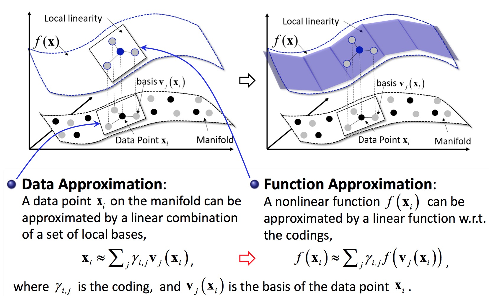
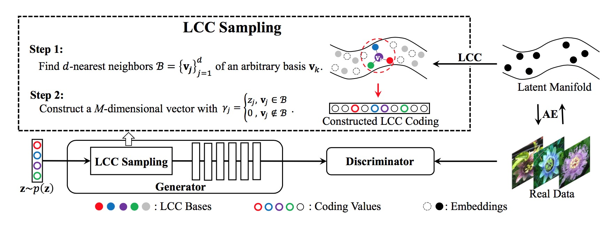
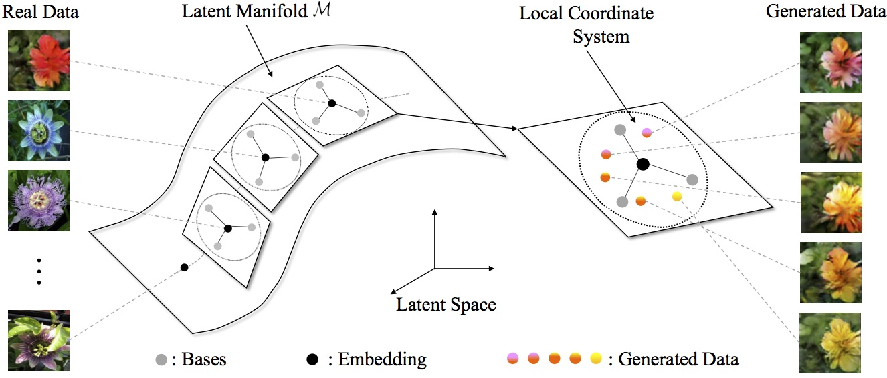
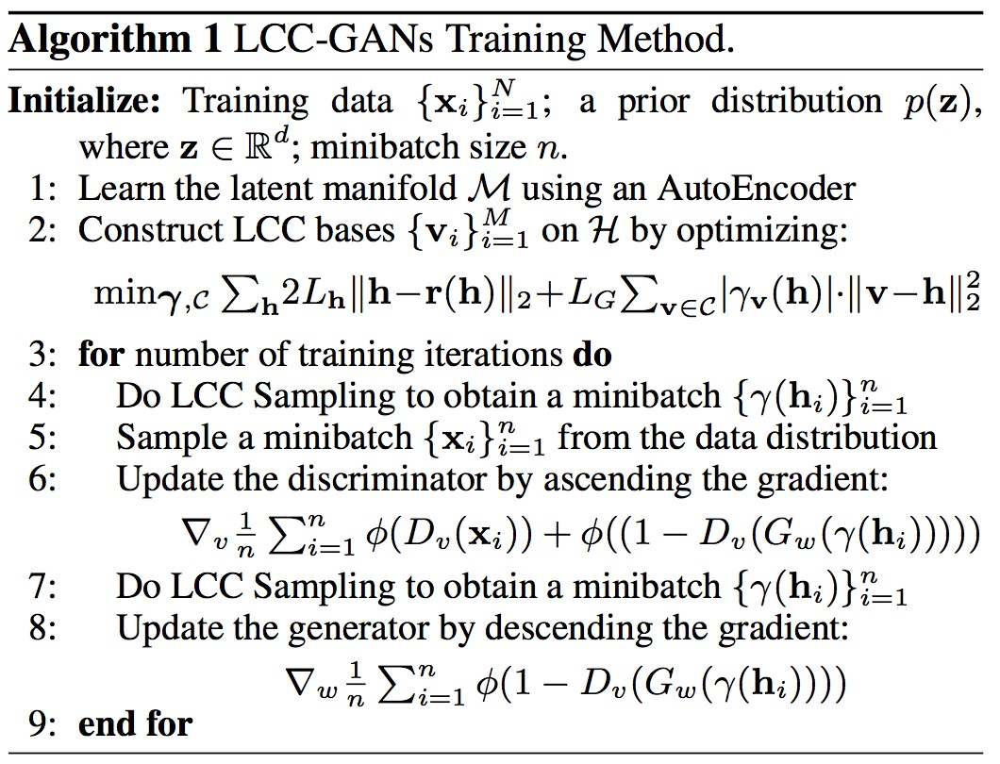

## LCCGAN

Pytorch implementation for “Adversarial Learning with Local Coordinate Coding”.

## Demonstration of Local Coordinate Coding (LCC)


## Architecture of LCCGAN

- AutoEncoder (AE) learns embeddings on the latent manifold.
- Local Coordinate Coding (LCC) learns local coordinate systems.
- The LCC sampling method is conducted on the latent manifold.

## Gometric Views of LCC Sampling

- With the help of LCC, we obtain local coordinate systems for sampling on the latent manifold.
- Using the local coordinate systems, LCC-GANs always sample some meaningful points to generate new images with different attributes.

## Objective Function
Given a generator $G_w$ and a discriminator $D_v$ with their parameters $w \in \mathcal W$ and $v \in \mathcal V$, respectively, we minimize the objective function:
$$
\mathop {\min}\limits_{\small{w \in \mathcal W}} 
\mathop {\max}\limits_{\small{v \in \mathcal V}} 
\mathop \mathbb E \limits_{\bf x \sim \widehat{\mathcal D}_{real}} \big[ \phi (D_v(\bf x)) \big]
\small{+} \mathop{\mathbb E} \limits_{\bf h \sim \mathcal H} \big[ \phi \big( \widetilde{D}_v\left(G_w\left({\bold \gamma}(\bf h) \right) \right) \big) \big],
$$
where $\phi(\cdot)$ is a monotone function and $\mathcal H$ is the latent distribution.

## Training Algorithm


## Dependencies
python 2.7

Pytorch

## Dataset
In our paper, to sample different images, we train our model on four datasets, respectively.

- Download [Oxford-102 Flowers](http://www.robots.ox.ac.uk/~vgg/data/flowers/102/)  dataset.

- Download [Large-scale CelebFaces Attributes (CelebA)](http://mmlab.ie.cuhk.edu.hk/projects/CelebA.html)  dataset.

- Download [ Large-scale Scene Understanding (LSUN) ](http://lsun.cs.princeton.edu/2016/)  dataset.

## Training
- Train AEGAN on Oxford-102 Flowers dataset.
```
python train.py --dataset flowers --dataroot your_images_folder --batchSize 16 --imageSize 512 --niter_stage1 100 --niter_stage2 1000 --cuda --outf your_images_output_folder --gpu 3
```
- If you want to train the model on Large-scale CelebFaces Attributes (CelebA), Large-scale Scene Understanding (LSUN) or your own dataset. Just replace the hyperparameter like these:
```
python train.py --dataset name_o_dataset --dataroot path_of_dataset
```

